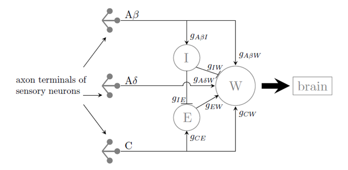

# Simulation of Spinal Cord Stimulation for pain control
 
The following work was done as part of project for 'Neural Implants and Interfaces' course at Johns Hopkins University.
 

### Model implemented

 

 
### Input signal representing pain sensation to Dorsal Horn Circuit

### Response curves 

 
### Simulation of pain suppression 

